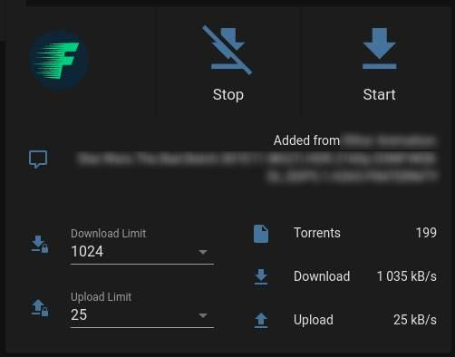

# Flood integration for Home Assistant

This a _custom component_ for [Home Assistant](https://www.home-assistant.io/).
The `flood` integration allows you to get information and control your [Flood WebUI torrent client](https://github.com/jesec/flood), based on last @jesec version.

## Installation

Copy the `custom_components/flood` folder into the config folder.

## Configuration

To add flood to your installation, go to Configuration >> Integrations in the UI, click the button with + sign and from the list of integrations select Flood.

## Lovelace suggestion



```yaml
type: vertical-stack # or custom:vertical-stack-in-card if you have it
cards:
  - cards:
      - type: markdown
        content: >-
          <center><a href="http://IP_FLOOD" target="_blank"></a></center>
      - type: button
        name: Stop
        show_state: false
        tap_action:
          action: call-service
          service: flood.stop_all_torrents
          service_data: {}
          target: {}
        icon: mdi:download-off
        icon_height: 30px
      - type: button
        name: Start
        icon: mdi:download
        show_state: false
        tap_action:
          action: call-service
          service: flood.start_all_torrents
          service_data: {}
          target: {}
        icon_height: 30px
    type: grid
    columns: 3
    square: false
  - type: entities
    entities:
      - entity: sensor.flood_last_notification
        name: " "
  - type: horizontal-stack
    cards:
      - type: entities
        entities:
          - entity: select.flood_download_limit
          - entity: select.flood_upload_limit
      - type: entities
        entities:
          - entity: sensor.flood_torrents
          - entity: sensor.flood_current_download
            name: Download
          - entity: sensor.flood_current_upload
            name: Upload
```
